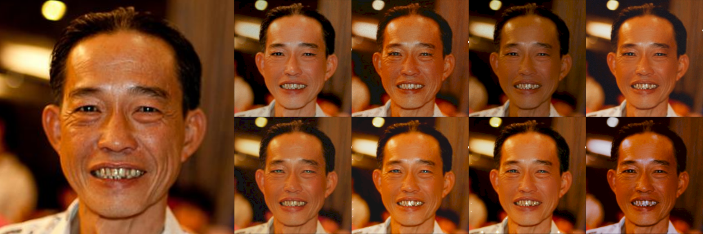

# Beautified Datasets

## FairBeauty
FairBeauty is a beautified version of the FairFace dataset (LINK), a dataset promoting algorithmic fairness in Computer Vision systems. The choice of this dataset is motivated by its focus on diversity and our will to be representative of the population of Instagram, without biasing the results. Eight popular, AR beauty filters are applied on equal portions of the original dataset. **PUT LINK TO FAIRBEAUTY SPECIFICALLY**

The image above is an example of the eight different beauty filters applied to the left-most image from the FairFace dataset. From left to right and top to bottom: filter 0 "pretty"by herusugiarta; filter 1 "hari beauty" by hariani; filter 2 "Just Baby" by blondinochkavika; filter 3 "Shiny Foxy"; filter 4 "Caramel Macchiato" and filter 5 "Cute baby face" by sasha_soul_art; filter 6 "Baby_cute_face_" by anya__ilicheva; filter 7 "big city life" by triutra.

The AR beauty filters detect the position of the faces in an original image and super-impose digital content to modify the original facial features. As these filters apply the same transformation to the facial features of all faces, we hypothesize that they homogenize facial aesthetics making the beautified faces more similar to each other. To determine the homogenization of the filtered faces, we consider different face verification models, i.e. DeepFace, VGG-Face, Facenet, CurricularFace, MagFace and ElasticFace. The code for these experiments is available in files **put names of the files**.

## B-LFW
B-LFW is a beautified version of the LFW (Labeled Faces in the Wild) dataset, a public benchmark dataset for face verification, designed for studying and evaluating unconstrained face recognition systems. This dataset contains more than 13,000 facial images of 1,680 different individual. We have beautified LFW with the same eight popular Instagram beauty filters, using different filters on different images from the same individuals. **PUT LINK TO B-LFW SPECIFICALLY**

The analysis of the B-LFW dataset may lead to new insights on understanding the impact of such filters on face recognition, particularly when no explicit occlusion is applied. We evaluate the performance of three state-of-the-art models (CurricularFace, ElasticFace and MagFace) on face recognition both on each single beauty filter (applied to LFW) and on the \textsc{B-LFW} dataset (in which different beauty filters are applied on different images of the same individual). The code for these experiments is available in files **put names of the files**.

## License and attribution
CC BY-NC 4.0
The framework and the datasets are part of a scientific paper currently under review for **NAME OF THE CONFERENCE**, under the title **TITLE OF THE PAPER**.

