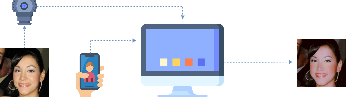
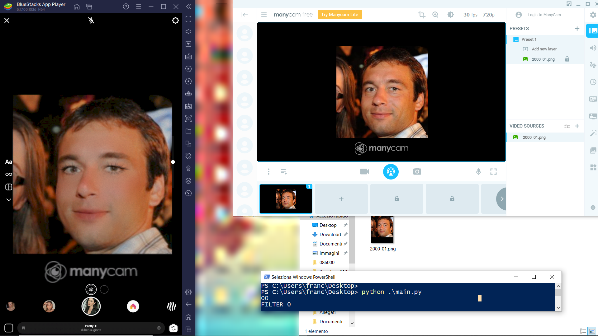

# OpenFilter: the framework

## Requirements:
(1) an Android Emulator;
(2) a computing machine;
(3) a virtual webcam. 

A pipeline of the sketch is provided in the figure below.

The Android emulator runs on the machine, where the social media application targeted in the research is installed. In the emulator, the researcher may access any available AR filter of the social media platform. Most of these filters can only be applied on live images from the camera. To overcome this limitation, the virtual webcam projects the existing image dataset on the camera enabling the application of the AR filters on it. The process is automatized through an auto-clicker system: each image is first projected on the camera; next, the filter is applied to the image and finally the filtered image is saved on disk. OpenFilter processes an image every 4 seconds on a Intel(R) Core(TM) i7-8565U machine with NVIDIA GeForce MX150, i.e. around 900 images per hour and 22,000 per day. 

## 1. Instructions for use
#### 1.1 Installation
In our implementation, we run OpenFilter using BlueStacks 5.7 (www.bluestacks.com) as Android emulator. On the virtual phone, researchers can download any targeted social media application for research (in our implementation, we refer to Instagram). Once the application is downloaded, the researcher should log in or create a new account, saving the targeted AR filters among the favorites. In addition, they should also download ManyCam 7.10 (www.manycam.com), a virtual camera software. The aim of this virtual camera is to by-pass the issue related to the application of AR-based filters on existing images. 

The process of the application of these filters is automatized through an auto-clicker script, available in our file main.py.

#### 1.2 Set-up
Please, ensure the following settings are properly set: in ManyCam, the resolution must be set to 720p with 30fps; in Bluestacks, under the Display Settings, the resolution must be set to 2560 x 1440 pixels with 320 DPI; finally ManyCam Virtual Webcam must be set as the default one on the machine. 

Being based on an auto-clicker system, the positioning of the objects on the display is key for the functioning of the OpenFilter. In the Figure below, we provide a screenshot of the ideal set-up on a 1920 x 1080 pixels monitor.

Note that the Android emulator must be positioned at the left-hand side of the screen, aligned with the borders of the screen (left, top, bottom). The interface of the virtual camera, instead, has to be positioned on the right-hand side, leaving space for the command line at the bottom.

Through the command line, execute the following commands:

> git clone https://github.com/ellisalicante/OpenFilter.git
> cd OpenFilter/OpenFilter
> mkdir swapper

These commands create one empty folder named "swapper", which must be positioned in the bottom right corner of the screen, as showed in the image above. In this way, the autoclicker can use that folder to temporarily store the image being processed and load it into the virtual camera.

The Instagram camera must be opened through the "new story" icon on the application (top-left corner), hence selecting the first available AR filter among the pre-saved ones. At this point, everything is ready to run the code:

> python .\main.py --dataset DATASET_PATH --output OUTPUT_PATH

**--dataset** is the path of the dataset that the user wants to filter through OpenFilter.
**--output** is the path where the filtered images are saved.
**--n_filters, default = 8** is the number of pre-saved filters (targeted by the user).
**--move_right, default=False** is the direction to follow for changing the filter (i.e. the order in which they have been pre-saved on the application). In our experiments, we have used 8 filters, showed in the Instagram interface, from right (filter 0) to left (filter 7). In the image above, you can notice we start the script from our first filter (Pretty by @herusugiarta), with the others located on its left.

We strongly encourage our readers to deactivate notifications while running OpenFilter. Sudden pop-ups could damage the final results. OpenFilter saves the filtered images by taking screenshot, rather than downloading the image directly from the application. This is motivated by the will of accelerating the process: very often, images treated with AR filters are downloaded as videos, causing remarkable delays in the saving process. OpenFilter is designed to filter large collection of images and, as a consequence, the fluidity of the system is one of the main requirements.

#### 1.3 Error handling
The current version of OpenFilter occasionally might create some errors while running. In the preparation of our datasets, we encountered two types of errors: (1) ManyCam does not load an image successfully and displays a noisy screen; and (2) ManyScren gets stuck and processes the same image multiple times. Under the name **put file name**, we share the code to automatically detect these errors and encourage our readers to perform error checks and corrections when creating new datasets using OpenFilter.

(put some more details regarding how to use these files)

## 2. License and attribution
CC BY-NC 4.0
The framework and the datasets are part of a scientific paper currently under review for the 36th Conference on Neural Information Processing Systems (NeurIPS 2022) Track on Datasets and Benchmarks., under the title "OpenFilter: A Framework to Democratize Research Access to Social Media AR Filters", by Piera Riccio, Bill Psomas, Francesco Galati, Francisco Escolano, Thomas Hofmann and Nuria Oliver.

